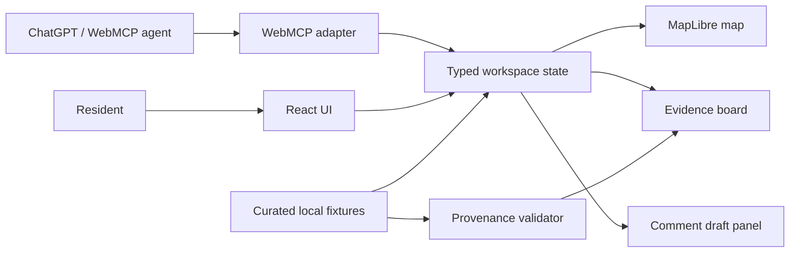
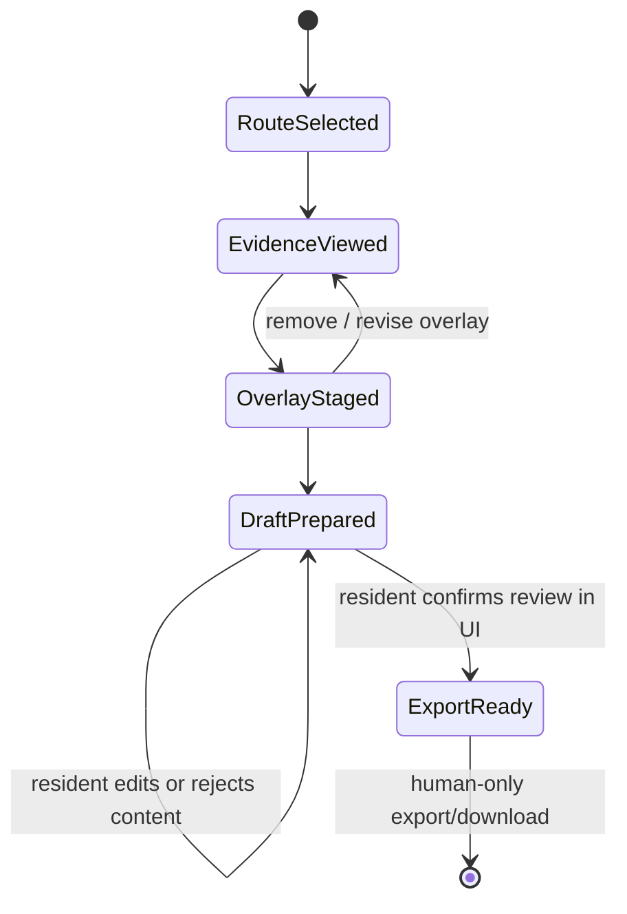

# Grounded Route — Technical Design Document

**Status:** Draft v0.1 — pending independent Sol review  
**Owner:** raffieeey  
**Project type:** OpenAI WebMCP Challenge MVP  
**Repository:** `raffieeey/grounded-route` (private during design/build; public with license before challenge submission)

---

## 1. Context: what we are trying to build

**Grounded Route** is a WebMCP-native civic-planning workspace. It helps a resident understand how a proposed planning change could affect the route they actually use, while making the evidence, uncertainty, and final voice visible and controllable.

The first demonstration focuses on a **small Kuala Lumpur area**. A resident chooses a scenario such as a wheelchair route to a school. They can see a route, relevant planning evidence, and affected segments on one map/evidence workspace. An agent operating through WebMCP sees the exact same current route, active constraints, and visible evidence. It can stage a reversible impact overlay and prepare a source-linked public-comment draft. The resident can inspect, correct, reject, or export the draft.

This is deliberately not an AI system that decides whether a plan is accessible, legal, safe, or approved. It is an evidence-led conversation surface that turns a dense plan document into an auditable shared artifact.

### 1.1 Competition thesis

The challenge rewards WebMCP leverage, execution, impact, and creativity. Grounded Route makes WebMCP necessary rather than decorative:

- the agent acts on **the same active map, route, and evidence cards** the resident sees;
- agent actions create **visible, reversible drafts**, not invisible backend mutations;
- every planning assertion is linked to a curated source record or explicitly labelled as an inference/unknown;
- the consequential act — using a comment outside the app — remains an explicit human choice.

### 1.2 The first user story

> A parent using a wheelchair needs to know whether a proposed street or land-use scenario could affect the safest known route between home and school. They need evidence they can inspect, not an assistant that speaks for them.

### 1.3 Why Kuala Lumpur

The MVP uses public DBKL Kuala Lumpur Development Plan 2040 documents as the planning-evidence source and OpenStreetMap geometry as the map base. The prototype must only make claims that can be traced to a curated source excerpt and never imply that OpenStreetMap tags are a field-certified accessibility assessment.

---

## 2. Product boundary

### 2.1 In scope for MVP

1. One hand-curated demonstration neighborhood of roughly 5–10 blocks.
2. One clearly labelled planning scenario and 6–12 cited source excerpts.
3. Three preset resident profiles:
   - wheelchair user;
   - school-pickup parent;
   - cyclist.
4. A map with route segments, planned/possible-impact overlays, and an evidence panel.
5. WebMCP tools for reading route context, retrieving evidence, staging/removing an overlay, and drafting a comment.
6. A human-only export/download of a prepared comment. No external government submission.
7. Browser-local state persistence for the demo session only.

### 2.2 Explicit non-goals

- City-wide or real-time planning analysis.
- Routing guarantees, field accessibility certification, legal advice, or public policy recommendation.
- Uploading a resident's actual address or sending personal data to a server.
- Live government API integration or automated public-comment submission.
- General-purpose LLM chat, autonomous browsing, or a FastMCP server as a substitute for WebMCP.
- Inference from unverified external material as if it were an official planning fact.

---

## 3. Golden path

### First 60 seconds

1. The resident opens the page and sees a short explanation, a demo neighborhood map, and profile buttons.
2. They select **Wheelchair route to school**.
3. The map shows the known demonstration route and its constraints: avoid steps, prefer crossings, and flag uncertain kerb conditions.
4. They select a planning scenario. Relevant source-backed evidence cards appear.
5. They ask the agent: “Show me what this could affect on my route.”
6. The agent stages a highlighted overlay. The resident sees the affected segments, the evidence used, and what remains uncertain.

### Aha moment

The resident sees an agent-created overlay tied to exact plan evidence on the map they are already viewing, then changes or rejects a weak interpretation before it becomes part of a comment draft.

### Core loop

`select route → inspect evidence → stage impact → review/revise → draft/export`

Target interaction budget:

- local map and state updates: under 100 ms after data is loaded;
- initial static app load: under 2 s on a normal broadband connection;
- any agent-driven tool call: clear visible pending state immediately; never silently mutate the map;
- the resident can remove a staged overlay in one action.

---

## 4. Architecture

### 4.1 MVP architecture decision

Use a **client-side TypeScript application** with no required backend for the first judged build.

Rationale:

- The source fixture is deliberately small and static.
- A no-server design reduces privacy risk, deployment complexity, and hackathon scope.
- WebMCP is browser-native; client-side tool handlers can call the same deterministic state actions as the human UI.
- A backend or FastMCP service is only justified after the human-agent visual loop works and a real requirement appears.

### 4.2 Proposed stack

| Layer | Choice | Reason |
|---|---|---|
| App | React + TypeScript + Vite | Fast static build, typed state/actions, deployable anywhere. |
| Map | MapLibre GL JS | Open-source vector-map rendering with GeoJSON support. |
| State | Small typed store / reducer | Every action must be traceable, reversible, and testable. |
| Validation | Zod or equivalent runtime schemas | Validate local fixture data and WebMCP tool inputs/outputs. |
| Data | Local versioned JSON / GeoJSON | Clear provenance, reproducible demo, no fragile live API dependency. |
| Tests | Vitest + Playwright | Unit/action contract tests plus human-first browser flow. |
| Deployment | Static hosting | No server secrets, simple preview and final deployment. |

### 4.3 Component diagram



### 4.4 Key rule

**The human UI and WebMCP tools must call the same domain actions.**

A WebMCP tool must never update map DOM elements ad hoc. It calls a typed action such as `stageImpactOverlay()`, which updates state; the map and evidence panels render that state. This makes agent activity inspectable, undoable, and testable.

---

## 5. Data design and provenance

### 5.1 Fixture layout

```text
data/
  route_segments.geojson      # 10–20 selected road/path segments
  places.geojson              # fictionalised/home-safe origin, school, crossings, transit
  plan_claims.json            # 6–12 vetted source excerpts and traceability fields
  route_profiles.json         # profile constraints and preferred routes
  demo_scenarios.json         # deterministic scenario-to-segment relationships
```

### 5.2 Data classes

| Data class | Authority | How it may be used |
|---|---|---|
| `source-confirmed` | Official DBKL document excerpt with page and URL | May appear as a direct claim in the evidence board. |
| `model-inference` | Agent synthesis constrained by source-confirmed records | Must state it is an interpretation and link its inputs. |
| `user-report` | Resident's note | Must be labelled as a user report, not a verified civic fact. |
| `unknown` | Missing, conflicting, or unverified information | Must remain visible as unresolved; do not turn into a claim. |

### 5.3 `plan_claims.json` contract

```ts
interface PlanClaim {
  id: string;
  title: string;
  sourceUrl: string;
  documentTitle: string;
  page: number;
  excerpt: string;
  claimType: "source-confirmed";
  affectedSegmentIds: string[];
  scenarioIds: string[];
  publishedAt?: string;
  reviewedAt: string;
}
```

Validation rules:

- `excerpt`, `page`, `documentTitle`, and `sourceUrl` are mandatory.
- A route-impact statement cannot cite a claim outside its `affectedSegmentIds` without displaying an uncertainty label.
- The fixture must not contain a resident's real home address.
- A source URL is shown in the UI and exported draft.

### 5.4 OSM use and limits

OpenStreetMap/Overpass data supplies route geometry and community tags such as crossings, steps, paths, cycleways, or sidewalk-related tags. It does **not** prove present-day accessibility, construction status, or safety. Any local observation is a `user-report` or `unknown` until field-verified.

---

## 6. Domain model and state machine

```ts
interface WorkspaceState {
  selectedProfileId: string | null;
  selectedScenarioId: string | null;
  selectedRouteId: string | null;
  activeEvidenceIds: string[];
  stagedOverlay: ImpactOverlay | null;
  commentDraft: CommentDraft | null;
  approval: {
    residentReviewedOverlay: boolean;
    residentReviewedDraft: boolean;
  };
  auditLog: AuditEvent[];
}
```

### 6.1 Allowed state transitions



Invariants:

1. A staged overlay must reference one or more evidence IDs.
2. A comment draft must list the evidence IDs it relies on and unresolved questions.
3. The agent cannot transition a draft to `ExportReady`; only a direct resident UI interaction can set `residentReviewedDraft=true`.
4. No tool sends network requests to a public body or publishes text externally.
5. Every write action appends an audit event with actor (`human` or `agent-tool`), inputs, timestamp, and before/after summary.

---

## 7. WebMCP interface

### 7.1 Progressive enhancement

The app must operate fully as a human-only route/evidence workspace when `document.modelContext` is absent. The WebMCP adapter is feature-gated and introduces no UI failure when unavailable.

At implementation time, the exact API surface and registration signature must be verified against current official WebMCP/Chrome documentation. No framework-memory implementation is acceptable.

### 7.2 Tool design

Tools are narrow, typed, and state-aware. They return small structured results and do not expose unrelated fixture data.

| Tool | Classification | Inputs | Result / visible effect |
|---|---|---|---|
| `get_route_context` | read-only | none | Current profile, route, constraints, scenario, selected layers. |
| `find_plan_evidence` | read-only / source content handled as untrusted for agent reasoning | `segmentIds`, optional `question` | Matching curated claims, URLs, excerpts, and uncertainty. |
| `stage_impact_overlay` | reversible draft write | `segmentIds`, `evidenceIds`, `summary`, `confidence` | A visibly highlighted draft overlay and linked evidence cards. |
| `clear_staged_overlay` | reversible draft write | none | Removes the active draft overlay; audit event remains. |
| `draft_public_comment` | reversible draft write | `evidenceIds`, `position`, `requestedChange`, `openQuestions` | Editable text with citations and uncertainty language. |
| `get_review_status` | read-only | none | What is staged, what the resident has reviewed, and why export is or is not available. |

**Not a tool:** external publication. The app offers a final browser download/copy action only after direct human review in the visible UI.

### 7.3 Registration lifecycle

1. Register read tools when the workspace has loaded.
2. Register overlay actions only after a route and scenario are selected.
3. Register draft-comment action only while source-linked evidence exists.
4. Unregister context-specific actions when their required state disappears.
5. All handlers validate input and return actionable errors without silently changing state.

### 7.4 Tool annotations and trust

- Apply read-only annotations to inspection tools.
- Mark user-supplied notes and externally sourced text appropriately as untrusted content for downstream agent reasoning.
- Keep names, parameter descriptions, and outputs concise.
- Return evidence identifiers and source URLs rather than unbounded document text.

---

## 8. UX, accessibility, and safety

### 8.1 Page layout

- **Map canvas:** route, affected segments, selected overlays.
- **Evidence board:** source cards with excerpt, document/page, link, and certainty label.
- **Draft panel:** source-linked comment with visible unresolved questions.
- **Audit/consent strip:** “what the agent changed,” undo, and explicit resident-review status.

### 8.2 Accessibility requirements

- Keyboard operable profile, route, evidence, overlay, and draft controls.
- Map alternatives in a structured route/evidence list, not visual color alone.
- High-contrast semantic status labels; do not depend on red/green alone.
- Screen-reader announcements for staged overlay and draft changes.
- Plain-language warnings: “This is a planning-evidence demo, not a certified accessibility assessment.”

### 8.3 Privacy and safety requirements

- No real address is necessary for the demo; use fictionalized demonstration origins.
- Store draft state in-memory or browser local storage only; make “clear local data” visible.
- No server logging of routes or comments in the MVP.
- Do not call a third-party LLM API from the app. The agent interaction is through the supported WebMCP environment.
- Show source/uncertainty provenance in the UI and exported draft.

---

## 9. Testing and evaluation plan

### 9.1 Deterministic tests

| Area | Required proof |
|---|---|
| Fixture validation | Invalid source records, missing pages/URLs, malformed GeoJSON, and missing affected segments fail validation. |
| Domain actions | Overlay cannot stage without evidence; clearing is reversible; drafts include cited source IDs and uncertainty. |
| Authority invariant | No agent-tool action can make a draft exportable; only direct human UI action can. |
| Human-only mode | App remains usable when WebMCP is unavailable. |
| UI | Profile selection, evidence selection, overlay review, draft editing, and export readiness. |

### 9.2 WebMCP evaluations

Build 8–12 deterministic evaluation cases covering:

- correct tool selection from normal-language requests;
- valid IDs and parameters;
- tool ordering (`get_route_context` before staging a context-sensitive overlay);
- refusal/clarification when evidence is missing;
- no unsupported claim is introduced into a draft;
- the tool cannot bypass the human-export requirement.

### 9.3 Manual evidence for submission

- Chrome DevTools or supported WebMCP environment shows registered tools and real calls.
- A <3-minute video shows: human-only state, agent tool call, visible staged map overlay, source evidence, resident correction, and human-only export.
- README contains run instructions, data limitations, and the public-source list.

---

## 10. Deployment and repository plan

### 10.1 Stages

1. **Design stage:** private repository, no sensitive data.
2. **Demo stage:** static preview deployment with only curated public/fictitious data.
3. **Submission stage:** make the repository public, verify a visible license, link the live URL, and freeze the judged revision according to challenge rules.

### 10.2 Repository structure

```text
.
├── docs/
│   ├── TECHNICAL_DESIGN.md
│   └── reviews/
├── data/
│   └── README.md
├── src/                     # created during implementation
├── tests/                   # created with implementation
├── README.md
├── LICENSE
└── .gitignore
```

---

## 11. Delivery milestones

| Milestone | Acceptance condition |
|---|---|
| M1 — Human-first map | Profile selection and deterministic fixture route work without WebMCP. |
| M2 — Evidence/provenance | Every visible impact card traces to a curated source record or says unknown. |
| M3 — WebMCP draft loop | Agent can inspect, stage, clear, and draft through real registered tools. |
| M4 — Human authority | UI-only approval/export invariant is tested and demonstrable. |
| M5 — Submission proof | Live static URL, public repo/license, tests, tools visible in supported environment, video completed. |

---

## 12. Risks, decisions, and open questions

### Fixed decisions

- Start with no mandatory backend and no FastMCP component.
- Use one small curated KL scenario, not a whole-city data claim.
- Use plan excerpts as the truth layer and OSM only as base geometry/tags.
- Keep public-comment action offline/export-only.
- Design WebMCP as progressive enhancement.

### Risks and mitigations

| Risk | Mitigation |
|---|---|
| WebMCP browser availability is experimental/gated | Human-first fallback; test in the challenge-supported environment early; record a real tool-call demo. |
| Plan PDFs are large/ambiguous | Curate a tiny cited fixture and keep original URLs/page references; do not parse live PDFs during demo. |
| OSM data is incomplete | Never represent it as certified accessibility data; surface uncertainty and field-verification need. |
| Civic claims feel overconfident | Require source IDs, labels, and unresolved questions in every agent-created draft. |
| Hackathon scope expands | Reject live city APIs, account systems, real address handling, and real submissions for MVP. |

### Open questions to resolve before implementation

1. Which exact KL planning scenario and 5–10 block area should become the fixture?
2. Which static host will be used for the final public demo?
3. Which supported ChatGPT/Chrome WebMCP environment will be used for final tool-call validation?
4. Should the first public-comment output be Markdown, plain text, or downloadable PDF? Default: Markdown/plain text first.

---

## 13. References

- OpenAI WebMCP Challenge: https://openai.com/webmcp-challenge/
- Challenge rules: https://webmcp.devpost.com/rules
- WebMCP specification: https://webmachinelearning.github.io/webmcp/
- Chrome WebMCP guide: https://developer.chrome.com/docs/ai/webmcp
- Chrome secure-tools guidance: https://developer.chrome.com/docs/ai/webmcp/secure-tools
- Chrome WebMCP evals: https://developer.chrome.com/docs/ai/webmcp/evals
- ChatGPT Site Tools guide: https://learn.chatgpt.com/docs/webmcp
- DBKL KLDP2040 downloads: https://ppkl.dbkl.gov.my/en/muat-turun/
- data.gov.my: https://data.gov.my/
- OpenStreetMap: https://www.openstreetmap.org/
- Overpass Turbo: https://overpass-turbo.eu/
